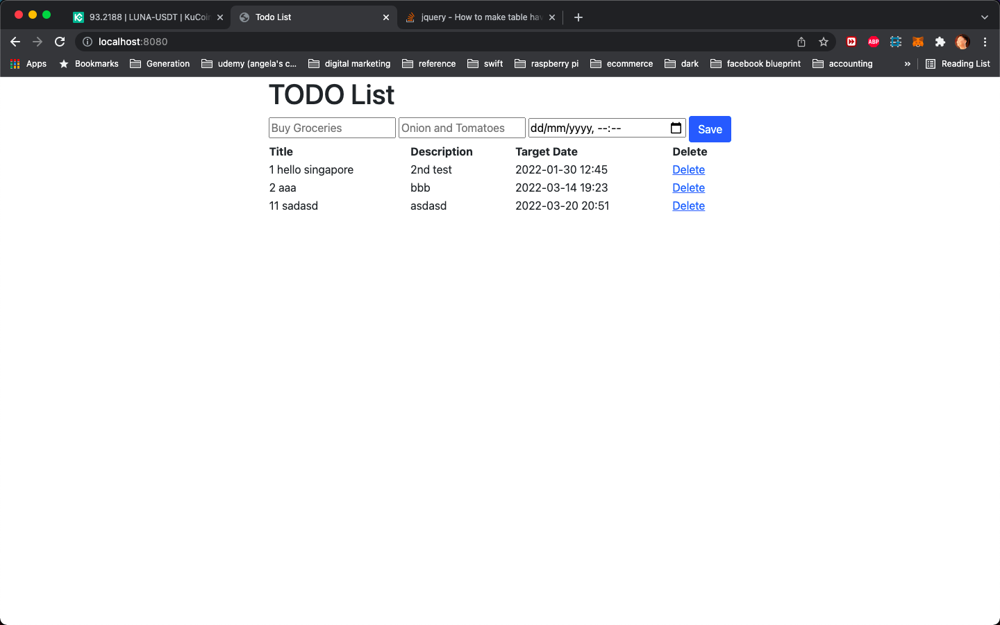

# Spring Boot Assessment: TodoList

This is my solution to TodoList. The assessment requires build a project about creating a Todo list from scratch, and explain the thought process.

## Table of contents

- [Overview](#overview)
  - [The challenge](#the-challenge)
  - [Screenshot](#screenshot)
  - [Links](#links)
- [My process](#my-process)
  - [Built with](#built-with)
  - [My Reflections](#Reflections)
- [Author](#author)
- [Acknowledgments](#acknowledgments)

## Overview

### The challenge

Users should be able to:

- Show all Todo list : Create a web page to display all Todo lists
- Add Todo list: Create a web page to allow users to add their Todo list
- Code is clean and well-written
- website should be deployed to Github Pages and accessible from a link

### Screenshot

### Links

- Live Site URL: [https://todolistspringboot01.herokuapp.com/](https://todolistspringboot01.herokuapp.com/)

## My process

### Built with

- Java
- Spring Boot
- MySQL
- HTML
- Flexbox

### Reflections

- what did i like about this project?
\
I like the challenge of this project because i had to put my skills into developing mysql database, spring boot server, and simple webpage
\
&nbsp;
- what did i struggle with in this project?
\
I wished i had more time to work on the project with Thymeleaf. To some extent, i did spend quite abit of time on unit-testing the Controller layer
\
&nbsp;
- what would you make your experience with this assessment better?
\
&nbsp;
I think this assessment is very realistic and there is no need to make it better. The reason being is the closely mirror a real technical interview. 

## Author

- Website - [Gareth's Linkedin](https://www.linkedin.com/in/garethfong/)

## Acknowledgments

I love to thank Generation Singapore and my lecturer, Jean Looi for their guidance and time. 
